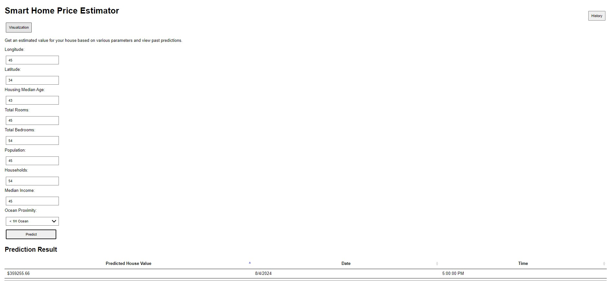
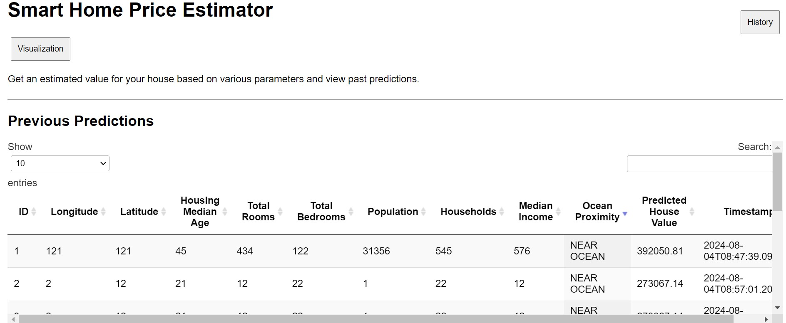
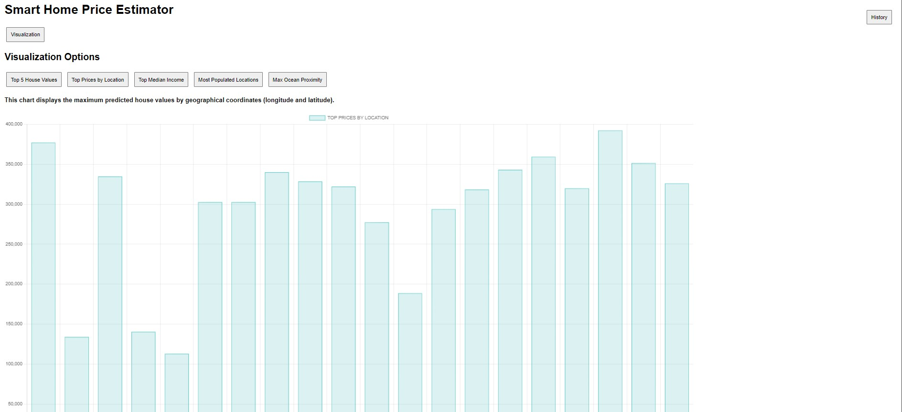

# Smart Home Price Prediction

## Project Overview

The Smart Home Price Prediction project aims to provide a user-friendly interface for predicting housing prices based on various features using a machine learning model. The project is built with FastAPI for the backend and HTML/CSS for the frontend, allowing users to input house characteristics and receive predictions.

## Table of Contents

- [Features](#features)
- [Technologies Used](#technologies-used)
- [Folder Structure](#folder-structure)
- [Setup and Installation](#setup-and-installation)
- [Running the Application](#running-the-application)
- [Backend Documentation](#backend-documentation)
- [Frontend Documentation](#frontend-documentation)
- [API Endpoints](#api-endpoints)
- [Testing](#testing)

## Features

- User-friendly interface for inputting house features.
- Predicts house prices based on user inputs.
- Stores prediction data in a database for future reference.
- RESTful API for backend services.
- Data visualization capabilities.

## Technologies Used

- **Backend:** FastAPI, SQLAlchemy, Pandas, scikit-learn
- **Frontend:** HTML, CSS, JavaScript
- **Database:** SQLite
- **Docker:** For containerization

## Folder Structure

SmartHomePricePrediction/
│
├── backend/
│ ├── database.py
│ ├── models.py
│ ├── schemas.py
│ ├── app.py
│ ├── Dockerfile
│ └── docker-compose.yml
│
├── frontend/
│ ├── static/
│ ├── templates/
│ ├── index.html
│ ├── new.css
│ └── new.js
│
├── tests/
│ ├── test_app.py
│
└── predictions.db

## Setup and Installation

### Prerequisites

- Python 3.8 or later
- HTML, CSS, JS (for frontend)
- Docker (optional)

### Backend Setup
1. Navigate to the `backend` directory:
    ```bash
    cd backend
    ```

2. Create a virtual environment and activate it:
    ```bash
    python -m venv venv
    source venv/bin/activate  # On Windows use `venv\Scripts\activate`
    ```

3. Install required packages:
    ```bash
    pip install -r requirements.txt
    ```

### Frontend Setup

1. Navigate to the `frontend` directory:
    ```bash
    cd ../frontend
    ```

2. Add HTML, CSS, JS
  Use datatables for interactive tables and chartjs for graphs


## Running the Application

### Running the Backend

1. Navigate back to the `backend` directory:
    ```bash
    cd backend
    ```

2. Run the FastAPI application:
    ```bash
    uvicorn app:app --reload
    ```

3. Access the API documentation at [http://localhost:8000/docs](http://localhost:8000/docs).

### Running the Frontend

1. Navigate to the `frontend` directory:
    ```bash
    cd ../frontend
    ```

2. Serve the HTML application:
    ```bash
    python -m http.server 8000
    ```

## Backend Documentation

### FastAPI Application (app.py)

- **Imports**: The application imports necessary modules, including FastAPI, SQLAlchemy, and the model and schema definitions.

- **Database Configuration**: The database connection and model definitions are configured in `database.py`, `models.py`, and `schemas.py`.

- **Endpoints**:
  - **GET `/`**: Serves the HTML page for user interaction.
  - **POST `/predict/`**: Accepts house feature data and returns a predicted house price based on the input.
  - **GET `/predictions`**: Returns all stored predictions.
  - **GET `/predictions/{id}`**: Fetches a specific prediction by ID.
  - **GET `/visualizations/{case}`**: Returns visualization data based on specific criteria.


## Frontend Documentation
### HTML Interface (index.html)
The HTML file provides a user-friendly form for inputting house characteristics, including:

Longitude
Latitude
Housing Median Age
Total Rooms
Total Bedrooms
Population
Households
Median Income
Ocean Proximity

### JavaScript Interaction (new.js)
JavaScript handles form submission, sending the input data to the FastAPI backend for prediction and displaying the result.

## API Endpoints
GET /: Home route to serve the frontend application.
POST /predict/: Predicts house price based on the provided features.
GET /predictions: Fetches all predictions.
GET /predictions/{id}: Fetches prediction by ID.
GET /visualizations/{case}: Fetches visualizations based on the case specified.

## Testing
To run tests, navigate to the tests directory and run:

pytest

## Docker Support
Steps to Build and Run Your Docker Container
-------------------------------------------
Navigate to your project directory:

Copy code
    
    cd path/to/SmartHomePricePrediction

Build your Docker container:

    docker-compose build

Run your Docker container:

    docker-compose up

Accessing Your Application
Once the containers are up and running, you should be able to access your FastAPI application at http://localhost:8000.

## Pages



